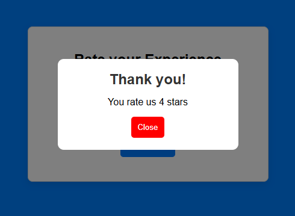

# ⭐ Star Rating App

A clean, interactive star rating component built with React that provides users with an intuitive way to rate their experience. Features smooth hover effects, visual feedback, and a confirmation modal for submitted ratings.




## ✨ Features

### Core Functionality
- **Interactive Star Rating**: Click to select rating from 1 to 5 stars
- **Hover Preview**: Real-time visual feedback when hovering over stars
- **Dynamic Feedback**: Contextual messages based on selected rating
- **Modal Confirmation**: Thank you modal displays after rating submission
- **Reset Capability**: Clear rating and start over after modal closes

### User Experience
- **Visual Feedback System**: 
  - ⭐ Gold stars for selected/hovered ratings
  - 🔘 Gray stars for unselected ratings
  - Smooth color transitions for better interaction feel

- **Feedback Messages**:
  - 1 Star: "Terrible"
  - 2 Stars: "Poor" 
  - 3 Stars: "Fair"
  - 4 Stars: "Good"
  - 5 Stars: "Excellent"

### Interface Design
- **Centered Layout**: Clean, card-based design with subtle shadows
- **Responsive Design**: Works seamlessly across different screen sizes
- **Accessible Interactions**: Keyboard and mouse support for all interactions
- **Disabled States**: Submit button disabled until rating is selected
- **Modal Overlay**: Professional modal with backdrop for rating confirmation

## 🛠️ Technology Stack

- **Frontend Framework**: React 19.1.0 with hooks (useState)
- **Build Tool**: Vite 7.0.4 for fast development and optimized builds
- **Styling**: Vanilla CSS with modern features (flexbox, transitions, hover effects)
- **Code Quality**: ESLint with React-specific rules and hooks validation
- **Development**: Hot Module Replacement (HMR) for instant updates

## 📁 Project Structure

```
src/
├── components/
│   ├── Rating.jsx        # Main rating component with state management
│   ├── Star.jsx          # Individual star component with hover/click handlers
│   ├── Modal.jsx         # Thank you modal for rating confirmation
│   └── Button.jsx        # Reusable button component
├── App.jsx               # Main application component
├── main.jsx              # Application entry point
└── index.css             # Global styles and component styling
```

## 🎨 Design Highlights

- **Blue Color Scheme**: Professional blue background (#0080ff) with clean white rating card
- **Card Design**: Centered white container with subtle shadow and rounded corners
- **Interactive Stars**: Large, clickable stars with smooth color transitions
- **Typography**: Clean Arial font with proper hierarchy and readable sizes
- **Button States**: Visual feedback for enabled/disabled submit button states
- **Modal Design**: Professional overlay modal with backdrop blur effect

## 🚀 Key Components

### Rating Component
Main component that orchestrates the rating experience:
- Manages rating state, hover state, and submission state
- Configurable heading, star color, and feedback messages
- Handles star interactions and modal display
- Provides reset functionality after submission

### Star Component
Individual star element with full interaction support:
- Click handling for rating selection
- Mouse enter/leave for hover effects
- Dynamic styling based on current state
- Unicode star character (★) for consistent display

### Modal Component
Confirmation dialog for submitted ratings:
- Conditional rendering based on submission state
- Displays selected rating with proper pluralization
- Close functionality that resets the entire component
- Overlay design with centered content

### Button Component
Reusable button with flexible styling:
- Props-based className and onClick handling
- Disabled state support
- Consistent styling across the application

## 💡 Usage Patterns

1. **Rating Selection**: Hover over stars to preview rating, click to select
2. **Visual Feedback**: See real-time color changes and feedback messages
3. **Submit Rating**: Click submit button (enabled only after rating selection)
4. **Confirmation**: View thank you modal with rating summary
5. **Reset Process**: Close modal to start rating process over

## 🎯 Component Features

### Customizable Props
- `heading`: Custom heading text (default: "Rate your Experience")
- `color`: Star color when active (default: "gold")
- `feedbackMessage`: Array of feedback messages for each rating level

### State Management
- **rating**: Currently selected rating (0-5)
- **hover**: Currently hovered rating for preview (0-5)
- **submitted**: Boolean flag for modal display control

### Interaction Handlers
- **handleRatingClick**: Sets the selected rating
- **handleHoverIn/Out**: Manages hover preview states
- **handleSubmit**: Processes rating submission
- **closeModal**: Resets component state

This Star Rating App demonstrates modern React development practices with focus on user interaction, visual feedback, and component reusability. The clean architecture makes it easy to integrate into larger applications or customize for specific use cases.